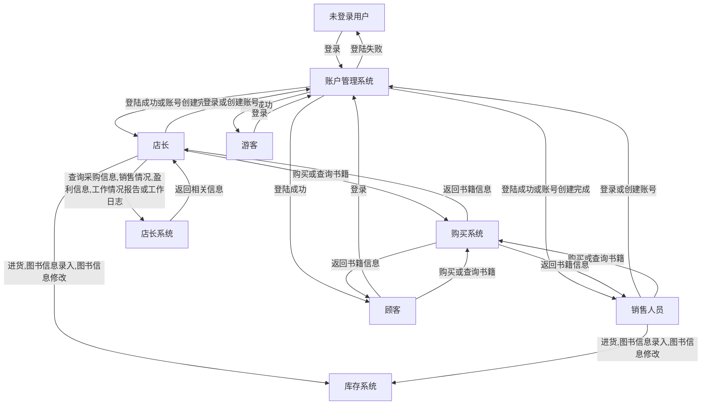
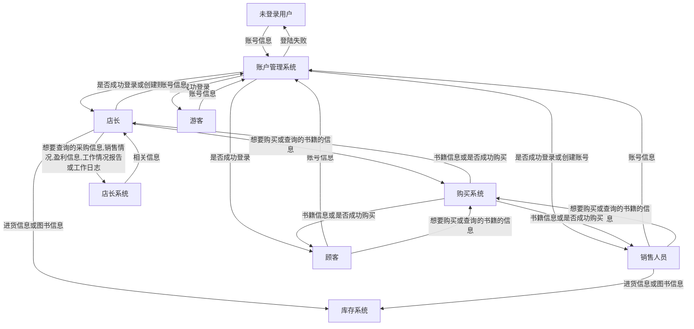

## 需求分析文档

### 业务流图

### 数据流图

### 数据词典

| 数据项 | 含义 | 存储文件 | 备注 |
| :--- | :---: | :---: | :---:|
| 用户账户 | ID、用户名、密码、权限 | user.dat | 权限从低到高 1/2/3/4 |
| 图书信息 | ISBN、书名、作者、关键词列表、库存量、单价	| book.dat | 无 |
| 交易记录 | 时间戳、操作类型、操作者ID、ISBN、数量、单价、总额	| log.dat | 操作类型：进货、卖出、修改等。按时间顺序依次加入 |

### 功能说明

| 模块名 | 输入 | 输出 | 所做处理 |
| :--- | :---: | :---: | :---:|
| 账户管理系统 | 登录或创建用户所用的用户名、密码 | 是否登录或创建成功 | 修改 log.dat。如果登陆成功则切换当前账户，如果创建用户成功则修改 user.dat |
| 购买系统 | 查询或购买图书所用的 ISBN 号、作者名字、关键字、书名中的任意组合 | 查询到的图书信息（或查询失败提示）或购买后的图书信息（或购买失败提示） | 修改 log.dat。如果购买成功则修改 book.dat |
| 库存系统 | 进货信息、录入或修改的图书信息	| 操作完成后的图书信息 | 修改 log.dat。修改 book.dat | 
| 店长系统 | 想要查询的内容（采购信息,销售情况,盈利信息,工作情况报告或工作日志） | 对应的信息 | 无 | 

### 用户交互设计

| 操作类型 | 输入格式 | 对应输出 |
| :--- | :---: | :---: |
| 登录/注册 | [log_in/sign_up] [username] [password] | 是否登录或注册成功 |
| 查询/购买图书 | [query/buy] [ISBN]? [author]? [keyword]? [book_name]? [total_money]? | 查询到的图书信息（或查询失败提示）或购买后的图书信息（或购买失败提示） |
| 进货/录入图书信息/修改图书信息 | [arrive] [ISBN] [number] [price] / [record] [book_name] [author] [keyword] [number] [price] / [modify] [ISBN]? [author]? [keyword]? [book_name]? [total_money]? | 操作完成后的图书信息 |
| 采购信息,销售情况,盈利信息,工作情况报告或工作日志 | [buy_in_info/sell_out_info/profit_info/work_log] / [working_info] [username] | 对应的信息 |