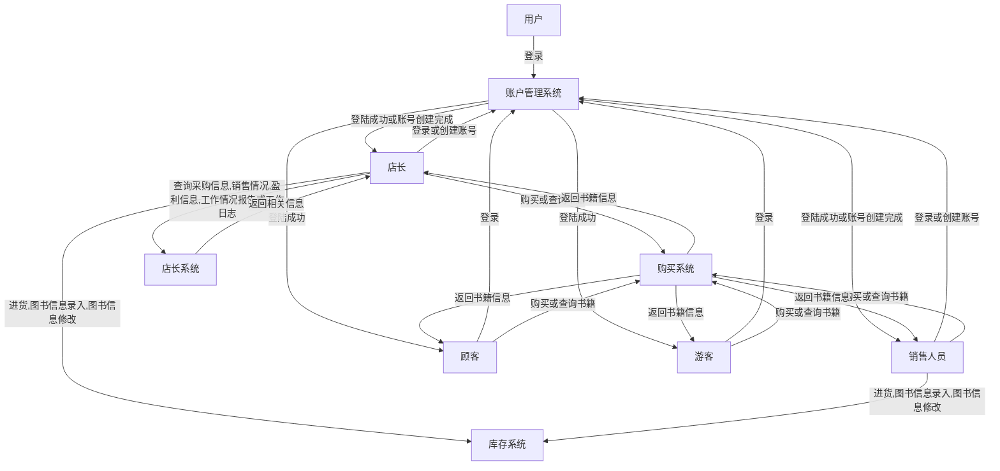

需求分析文档

```mermaid
graph TD

    A[用户] -->|登录| B[账户管理系统]
    B -->|登陆成功或账号创建完成| C[店长]
    B -->|登陆成功或账号创建完成| D[销售人员]
    B -->|登陆成功| E[顾客]
    B -->|登陆成功| F[游客]
    C -->|登录或创建账号| B
    D -->|登录或创建账号| B
    E -->|登录| B
    F -->|登录| B
    C -->|购买或查询书籍| G[购买系统]
    D -->|购买或查询书籍| G[购买系统]
    E -->|购买或查询书籍| G[购买系统]
    F -->|购买或查询书籍| G[购买系统]
    G -->|返回书籍信息| C
    G -->|返回书籍信息| D
    G -->|返回书籍信息| E
    G -->|返回书籍信息| F
    C -->|进货,图书信息录入,图书信息修改| H[库存系统]
    D -->|进货,图书信息录入,图书信息修改| H[库存系统]
    C -->|查询采购信息,销售情况,盈利信息,工作情况报告或工作日志| I[店长系统]
    I -->|返回相关信息| C
```

